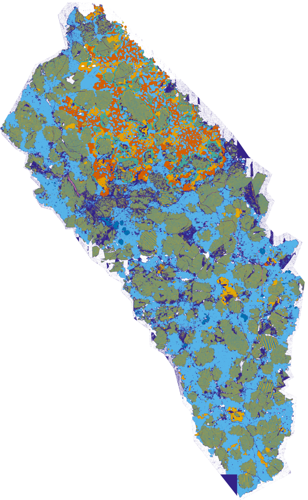

<picture>
  <source media="(prefers-color-scheme: dark)" srcset="docs/images/karak-logo-dark.svg">
  <source media="(prefers-color-scheme: light)" srcset="docs/images/karak-logo-light.svg">
  
</picture>

[](https://www.python.org/downloads/)
[](LICENSE)
[](https://hatch.pypa.io/)

---

**Karak** is an automated mineralogy pipeline that transforms SEM-EDS elemental map PNGs into mineral phase maps with chemical fingerprints. Named after the dwarven word for *stronghold*, it digs into the hidden structure of rocks, meteorites, and other geological samples.

<p align="center">
  
  <br>
  <em>Automated mineral phase map of meteorite NWA 4587</em>
</p>

## Features

- **End-to-end pipeline** — from raw jet-colormapped PNGs to labeled mineral phase maps in a single command
- **HDBSCAN clustering** — density-based clustering discovers mineral phases without requiring a predefined number of clusters
- **Tiled progressive strategy** — process large images tile-by-tile with automatic phase registry unification across tiles
- **Two-pass workflow** — optional second pass to detect rare mineral phases with a finer clustering resolution
- **Post-clustering refinement** — GMM-based splitting of composite phases (e.g., pyroxene into pigeonite + augite)
- **Checkpoint/resume** — every stage writes to HDF5; resume from any prior stage without reprocessing
- **Full provenance** — pipeline config, library versions, and timestamps embedded in every output file
- **QC diagnostics** — generates detailed figures at each stage for visual validation
- **YAML configuration** — all parameters in a single config file for reproducible analysis

## Installation

```bash
pip install karak
```

Or install from source for development:

```bash
git clone https://github.com/brendonhall/karak.git
cd karak
pip install -e .
```

## Quick Start

### 1. Organize your data

Place your SEM-EDS elemental map PNGs in a directory. Each PNG should be a jet-colormapped image named after the element it represents (e.g., `Si.png`, `Fe-K.png`, `Mg.png`). Include a `SEM.png` for the backscatter electron image.

```
data/
├── SEM.png
├── Si.png
├── Fe-K.png
├── Mg.png
├── Ca.png
├── Al.png
├── Na.png
└── config.yaml
```

### 2. Create a configuration file

```yaml
# config.yaml — minimal example
input_dir: "."
hdf5_output: "eds_pipeline.h5"
figure_dir: "figures"

exclude_elements: ["Fe-L"]
bse_channel: "SEM"

downsample:
  header_trim_px: 100
  downsample_factor: 2

mask:
  min_object_size: 100

denoise:
  method: bilateral
  sigma_spatial: 1.0

cluster:
  strategy: global
  pca:
    n_components: null       # inspect scree plot, then set
  hdbscan:
    min_cluster_size: 1000
    subsample_n: 500000
    noise_reassign_k: 5
```

### 3. Run the pipeline

```bash
cd data
karak
```

That's it. Karak auto-detects `config.yaml` in the working directory, runs all five pipeline stages, and writes results to an HDF5 file alongside QC figures.

## Usage

```bash
karak                              # run full pipeline
karak -c path/to/config.yaml       # use a specific config file
karak --from-stage denoise         # resume from a specific stage
karak --test-mode                  # fast validation (4 elements, 4x downsample)
karak --no-qc                      # skip QC figure generation
karak --clean                      # delete previous HDF5 and start fresh
karak -v                           # enable debug logging
```

## Pipeline

Karak processes data through five sequential stages. Each stage checkpoints its results to HDF5, so you can resume from any point.

```
    PNG element maps
          │
    ┌─────▼─────┐
    │   Load     │  Read PNGs, invert jet colormap, build compositional cube
    └─────┬─────┘
          │
    ┌─────▼─────┐
    │   Mask     │  Separate mineral pixels from background / epoxy
    └─────┬─────┘
          │
    ┌─────▼─────┐
    │  Denoise   │  Edge-aware smoothing (bilateral or anisotropic diffusion)
    └─────┬─────┘
          │
    ┌─────▼─────┐
    │ Normalize  │  Per-channel z-score normalization
    └─────┬─────┘
          │
    ┌─────▼─────┐
    │  Cluster   │  PCA → HDBSCAN → k-NN noise reassignment
    └─────┬─────┘
          │
    Phase map + chemical fingerprints
```

### Clustering Strategies

| Strategy | Best for | Description |
|----------|----------|-------------|
| `global` | Small–medium images | Single HDBSCAN run on entire image |
| `tiled` | Large images | Per-tile HDBSCAN with cosine-similarity phase registry unification |

The tiled strategy divides the image into spatial tiles, clusters each independently, then merges phases across tiles by matching their chemical fingerprints. This keeps memory usage bounded regardless of image size.

## Configuration

All pipeline parameters are controlled through a YAML config file validated by Pydantic. Below are some key parameters beyond the minimal example above.

### Tiled clustering

```yaml
cluster:
  strategy: tiled
  tiled:
    tile_size: 512
    merge_threshold: 0.92       # cosine similarity for phase matching
    min_clusters_per_tile: 3    # tiles with fewer clusters deferred to k-NN
```

### Two-pass rare phase detection

```yaml
cluster:
  rare_phase:
    enabled: true
    min_cluster_size: 50        # much smaller than primary pass
    subsample_n: 500000
```

### Post-clustering refinement

```yaml
cluster:
  refinement:
    enabled: true
    target_phase: 2             # cluster label to refine
    olivine:
      enabled: true
      fe_threshold: 0.6
      ca_threshold: 0.10
    gmm_split:
      enabled: true
      n_components: 2           # e.g., pigeonite + augite
      features: ["Ca", "Mg", "Fe-K", "BSE"]
```

## How It Works

**Jet colormap inversion** — SEM-EDS software commonly exports elemental maps as jet-colormapped PNGs. Karak inverts these back to scalar intensity values using a precomputed 256<sup>3</sup> RGB-to-scalar lookup table derived from matplotlib's jet colormap. The LUT is cached to disk and reused across runs.

**HDBSCAN clustering** — Unlike k-means, [HDBSCAN](https://hdbscan.readthedocs.io/) discovers the number of clusters automatically from data density. Pixels that don't belong to any dense region are labeled as noise and later reassigned to their nearest cluster via k-nearest-neighbor voting.

**Provenance tracking** — Every HDF5 output file embeds the full pipeline YAML config, library versions (NumPy, scikit-learn, HDBSCAN, etc.), Python version, and platform info as root-level attributes. This means any output file is self-documenting and fully reproducible.

## Contributing

Contributions are welcome! Please open an issue to discuss proposed changes before submitting a pull request.

```bash
git clone https://github.com/brendonhall/karak.git
cd karak
pip install -e .
```

## License

[MIT](LICENSE)
