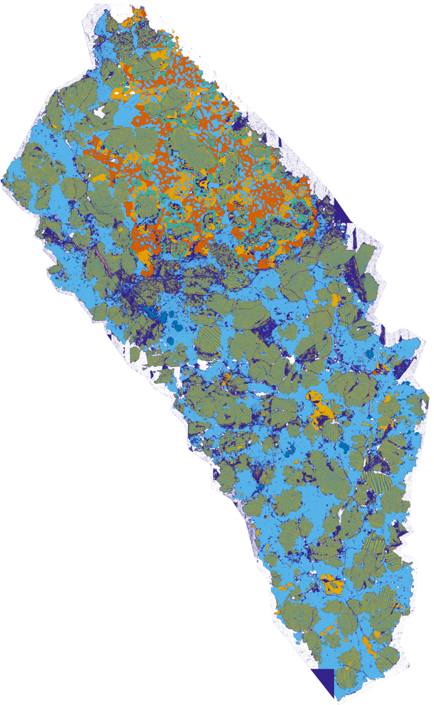

<picture>
  <source media="(prefers-color-scheme: dark)" srcset="docs/images/karak-logo-dark.svg">
  <source media="(prefers-color-scheme: light)" srcset="docs/images/karak-logo-light.svg">
  
</picture>

[](https://www.python.org/downloads/)
[](LICENSE)

---

**Karak** is an automated mineralogy pipeline that transforms SEM-EDS elemental map PNGs into mineral phase maps with chemical fingerprints. Named after the dwarven word for *stronghold*, it digs into the hidden structure of rocks, meteorites, and other geological samples.

Since v0.2.0, the pipeline is a graph rather than a script. Every processing step is a node with typed parameters and named ports. A pipeline is a JSON file wiring nodes together. The engine validates the graph before anything runs, executes it headlessly, and caches every node's output by content. The paper's full analysis (12.5 million mineral pixels, 15 phases with pixels) reruns as `karak run --builtin paper`: it reproduces the published preprocessing bit for bit, the published tiles and phases, and the six hand steps of the published analysis (names, olivine, weathering, 1x pyroxene and phosphate splits) as declared nodes; the abundances agree with the paper's Table 1 to within 0.50 pp for every phase, largest Weathering Assemblage at -0.50 pp (see the [user guide](docs/user_guide.md#flows)). Changing one refinement threshold reruns in minutes instead of two hours, because only the affected nodes execute.

<p align="center">
  
  <br>
  <em>Automated mineral phase map of meteorite NWA 4587</em>
</p>

## Paper

Karak accompanies the manuscript:

> Izawa, M. R. M., Hall, B. J., Cao, F., Luo, T., Yokoyama, S. T., & Zhao, Y. S.
> **Unsupervised mineral phase mapping from SEM-EDS element maps: a
> density-based clustering pipeline with multi-resolution refinement.**
> *Computers & Geosciences* (submitted 2026).

If you use Karak in your research, please cite the paper and the software.
Citation metadata is provided in [`CITATION.cff`](CITATION.cff).

## Features

- **End-to-end pipeline**: from raw jet-colormapped PNGs to labeled mineral phase maps in a single command
- **22 self-describing stages**: each declares typed, bounded parameters and named input/output ports; `karak schema` prints the whole contract as JSON
- **JSON flow graphs**: pipelines are DAGs of stages; three builtin flows cover the standard workflows, and custom flows are plain JSON files
- **Validation before compute**: the graph validator catches unknown stages, bad parameter values, unconnected inputs, port type mismatches, and cycles before a single pixel is processed
- **Per-node caching**: every stage output is cached by a hash of its parameters, upstream results, and input files; change one parameter and only downstream stages re-run
- **HDBSCAN clustering**: density-based clustering discovers mineral phases without a predefined cluster count
- **Tiled progressive strategy**: large images process tile-by-tile with automatic phase registry unification across tiles
- **Two-pass workflow**: an optional second pass detects rare mineral phases at a finer clustering resolution
- **Post-clustering refinement**: GMM-based splitting of composite phases (e.g., pyroxene into pigeonite + augite)
- **Full provenance**: the flow definition, library versions, and timestamps travel inside every output file
- **QC diagnostics**: figure sinks render diagnostics at each stage for visual validation
- **Complete flow files**: a pipeline is a JSON file that lists every parameter of every node, and each run keeps the exact flow it executed; no run parameter comes from code

## Installation

Requires Python 3.12+. Clone the repository and install with
[uv](https://docs.astral.sh/uv/) (recommended; reproduces the exact locked
environment used for the paper):

```bash
git clone https://github.com/brendonhall/karak.git
cd karak
uv sync            # creates .venv from uv.lock
uv run karak --help
```

Or install with pip into an existing environment:

```bash
git clone https://github.com/brendonhall/karak.git
cd karak
pip install -e .
```

## Quick Start

### 1. Organize your data

Place your SEM-EDS elemental map PNGs in a directory. Each PNG should be a jet-colormapped image named after the element it represents (e.g., `Si.png`, `Fe-K.png`, `Mg.png`). Include a `SEM.png` for the backscatter electron image.

```
data/
├── SEM.png
├── Si.png
├── Fe-K.png
├── Mg.png
├── Ca.png
├── Al.png
└── Na.png
```

### 2. Create a flow file

A flow is a JSON file that lists every stage (node), how their outputs
connect, and every parameter of every node. Start from a builtin:

```bash
karak flow init --builtin global -o my_flow.json
```

Edit parameter values in `my_flow.json` as needed. Each node lists all of
its stage's parameters, for example:

```json
{
  "id": "dn", "type": "denoise",
  "params": {"method": "bilateral", "sigma_spatial": 1.0, "sigma_color": null,
             "niter": 10, "kappa": 50.0, "gamma": 0.1, "option": 2,
             "device": "cpu"}
}
```

### 3. Run the pipeline

```bash
karak run my_flow.json --input data/ --out output/sample
```

Karak runs the pipeline and writes results to an HDF5 file alongside QC
figures. `--builtin global` runs a shipped flow without copying it first.

> **Note:** The first run with a given colormap builds a 256³ RGB-to-scalar
> lookup table (about 10 s for the default `tima:jet` palette). It is cached
> on disk and reused by all later runs. For a fast installation check, run
> with `--set src.downsample_factor=4 --set src.include_elements=Fe-K,Ca,Mg,Si`.

## Usage

```bash
karak flow init --builtin tiled -o my_flow.json                  # start from a builtin
karak flow complete old_flow.json                                # fill missing params
karak run --builtin global --input data/ --out output/sample     # standard pipeline
karak run --builtin tiled --input data/ --out output/sample      # tiled clustering
karak run --builtin tiled-rare --input data/ --out output/sample # tiled + rare phases
karak run my_flow.json --input data/ --out output/sample         # custom flow
karak run --builtin global --set hdb.min_cluster_size=500 ...    # override any parameter
karak run ... --workers 0                  # parallel stages on all cores (same results)
karak run ... --device cuda                # GPU paths where stages support it
karak validate my_flow.json        # structural checks without running
karak schema                       # print every stage's parameter schema as JSON
karak bench --builtin tiled --input DIR --out BASE \
    --config baseline --config workers=0   # per-node timing comparison
karak bench --compare a.json b.json        # cross-machine table
```

Re-running a flow is cheap: every stage output is cached under
`<out dir>/work/cache/`, keyed by the stage's parameters, its upstream
results, and the input files' signatures. Change one parameter and only the
affected stages re-run.

## Architecture

Karak is built in three layers. Higher layers wrap lower ones and never
reimplement the math.

```
┌─ flow/     graph model · validation · cache · executor · CLI   (orchestration)
│            runs JSON DAGs of stages headlessly, caches every node output
├─ stages/   self-describing steps: typed params + named ports    (composition)
│            one thin class per operation, over the numeric core
└─ io/ preprocessing/ clustering/ identification/ qc/             (numeric core)
             pure functions on numpy arrays
```

Stages pass immutable payloads (element cubes, masks, PCA features, labels)
between named ports. Each cube carries a space tag (`raw`, `denoised`,
`normalized`) and each label array a state tag (`raw`, `cleaned`), so the
validator rejects nonsensical connections, such as wiring a raw cube into
a stage that expects a denoised one, before anything runs.

### Ready for a node editor

Everything a visual flow editor needs already exists as data, with no
pipeline logic left to write in a front-end:

| Editor need | Already provided by |
|-------------|---------------------|
| Node palette with parameter widgets | `karak schema`: every stage's ports, types, template values, bounds, and help as JSON |
| File format checked while editing | [`docs/flow.schema.json`](docs/flow.schema.json): a JSON Schema with one node variant per stage and every parameter required |
| New node with sensible values | stage templates (`Stage.template()`, the schema's `default` annotations) |
| Legal-wiring rules | named ports with space/state type tags |
| Error badges on the canvas | `validate(graph)`, the same function the CLI uses |
| Save / load | the complete flow JSON, including a GUI-only `ui` field for node positions |
| Run button | the headless executor with per-node progress events and a run record |

### Ready for AI-driven workflows

The same contract that serves a GUI serves an agent. A language model can
read `karak schema`, compose a flow JSON for a new sample, check it with
`karak validate` before spending compute, and run it headlessly. Because
parameters are typed and bounded, the validator checks every generated
flow before it runs: a hallucinated stage name, an out-of-range sigma, or
a mis-wired port is rejected at validation, not discovered two hours into
a cluster run. The cache makes agent-driven parameter exploration cheap,
since each variant re-runs only the stages it changed. Every run keeps
the complete flow it executed in `{out}/runs/<time>/`, and every output
HDF5 embeds it, so any result an agent produces can be audited and
reproduced.

## Pipeline

The builtin `global` flow runs the standard sequence:

```
    PNG element maps
          │
    ┌─────▼─────┐
    │   Load     │  Read PNGs, invert jet colormap, build compositional cube
    └─────┬─────┘
          │
    ┌─────▼─────┐
    │   Mask     │  Separate mineral pixels from background / epoxy
    └─────┬─────┘
          │
    ┌─────▼─────┐
    │  Denoise   │  Edge-aware smoothing (bilateral or anisotropic diffusion)
    └─────┬─────┘
          │
    ┌─────▼─────┐
    │ Normalize  │  Per-channel z-score normalization
    └─────┬─────┘
          │
    ┌─────▼─────┐
    │  Cluster   │  PCA → HDBSCAN → k-NN noise reassignment
    └─────┬─────┘
          │
    Phase map + chemical fingerprints
```

In flow terms these are the stages `load_elements → mask → denoise →
normalize → pca → hdbscan_global → noise_assign → cluster_stats →
fingerprints → export_h5`, plus QC figure sinks. The `tiled` flow swaps in
`hdbscan_tiled`; `tiled-rare` adds a `rare_phase` stage. `name_phases`,
`split_threshold`, `split_gmm` and `split_hires` attach names and split
composite phases (the published NWA 4587 olivine, weathering, phosphate and
1x pyroxene splits are of this form; `split_hires` fits the pyroxene split
on the full-resolution maps). Optional
post-run stages `qc_named_phase_map` and the notebook helpers
`save_mineral_names`/`load_mineral_names` attach researcher-assigned
mineral names.

### Clustering Strategies

| Strategy | Best for | Description |
|----------|----------|-------------|
| `global` | Small–medium images | Single HDBSCAN run on entire image |
| `tiled` | Large images | Per-tile HDBSCAN with cosine-similarity phase registry unification |

The tiled strategy divides the image into spatial tiles, clusters each independently, then merges phases across tiles by matching their chemical fingerprints. This keeps memory usage bounded regardless of image size.

## Configuration

Flows are JSON: `nodes` (a stage `type` plus a `params` dict listing every
parameter of that stage) connected by `edges` (output port to input port).
Start from a builtin with `karak flow init`, or copy one from
[`src/karak/flow/flows/`](src/karak/flow/flows/). String parameters accept
the run-scoped tokens `{input}`, `{out}`, and `{work}`, so one flow file
works across datasets. `karak validate` rejects a flow with a missing
parameter; `karak flow complete FILE` fills missing ones from the stage
templates (listed in the [Stage Reference](docs/stage_reference.md)) and
prints what it added. Some parameters beyond the basics:

### Tiled clustering (`hdbscan_tiled` node)

```json
"params": {"tile_size": 512, "merge_threshold": 0.92,
           "min_clusters_per_tile": 3, "...": "..."}
```

### Two-pass rare phase detection (`rare_phase` node, `tiled-rare` flow)

```json
"params": {"min_cluster_size": 50, "subsample_n": 500000, "...": "..."}
```

### Splitting composite phases (`split_threshold`, `split_gmm`)

```json
{"id": "oliv", "type": "split_threshold",
 "params": {"target_phase": 2, "rule": "Fe-K > 0.6 & Ca < 0.10",
            "new_name": "Ferroan Olivine", "note": "..."}}
{"id": "phos", "type": "split_gmm",
 "params": {"target_phase": 7, "features": "Cl,Na,Mg,F", "n_components": 2,
            "keep_parent": false, "order_by": "Cl",
            "new_names": "Merrillite;Chlorapatite", "...": "..."}}
```

## Documentation

The **[User Guide](docs/user_guide.md)** covers input data expectations
(element maps, BSE image, valid-region polygon mask), the stage table with
inputs and outputs, payload types, flows, the HDF5 output layout, caching, and reproducibility notes.

The **[Stage Reference](docs/stage_reference.md)** documents every stage's
ports and parameters (types, defaults, bounds, help). It is generated from
the live registry and pinned by a test, so it cannot drift from the code.

## Hardware Requirements

Karak is CPU-only (no GPU required). Development and the analyses in the
paper were run on an **AMD Ryzen AI 5 340 with 32 GB RAM** (Linux).

- Full-resolution runs (~7400 x 5400 px, 21 element channels) use
  **~10–12 GB RAM**.
- Memory can be bounded for larger images via `cluster.hdbscan.subsample_n`
  or the `tiled` clustering strategy (constant per-tile memory).
- A 4x-downsampled run on four elements (`--set src.downsample_factor=4
  --set src.include_elements=Fe-K,Ca,Mg,Si`) checks an installation in
  minutes on a laptop.

## Testing

A fast pytest suite (colormap-inversion round-trip on a
synthetic ramp, mask utilities, per-stage parity against the numeric core,
flow validation/caching/executor behavior, and end-to-end flow runs on a
synthetic two-phase scene) runs in well under a minute:

```bash
uv sync
uv run pytest
```

The same suite runs in CI on every push and pull request
([`.github/workflows/ci.yml`](.github/workflows/ci.yml)).

## How It Works

**Jet colormap inversion.** SEM-EDS software commonly exports elemental maps as jet-colormapped PNGs. Karak inverts these back to scalar intensity values using a precomputed 256<sup>3</sup> RGB-to-scalar lookup table built from the 256-entry palette TIMA renders with (`tima:jet`, recovered from real exports); any matplotlib colormap or a custom palette file also works. The LUT is cached to disk and reused across runs.

**HDBSCAN clustering.** Unlike k-means, [HDBSCAN](https://hdbscan.readthedocs.io/) discovers the number of clusters automatically from data density. Pixels that don't belong to any dense region are labeled as noise and later reassigned to their nearest cluster via k-nearest-neighbor voting.

**Provenance tracking.** Every HDF5 output file embeds the complete flow definition, library versions (NumPy, scikit-learn, HDBSCAN, etc.), Python version, and platform info as root-level attributes. Any output file is self-documenting and reproducible.

## Authors

- **Brendon Hall**: [@brendonhall](https://github.com/brendonhall) · [ORCID](https://orcid.org/0000-0002-2244-4994)
- **Matthew Izawa**: [@matthewizawa](https://github.com/matthewizawa) · [ORCID](https://orcid.org/0000-0001-5456-2912)

## Contributing

Contributions are welcome! Please open an issue to discuss proposed changes before submitting a pull request.

```bash
git clone https://github.com/brendonhall/karak.git
cd karak
pip install -e .
```

## License

[MIT](LICENSE)
